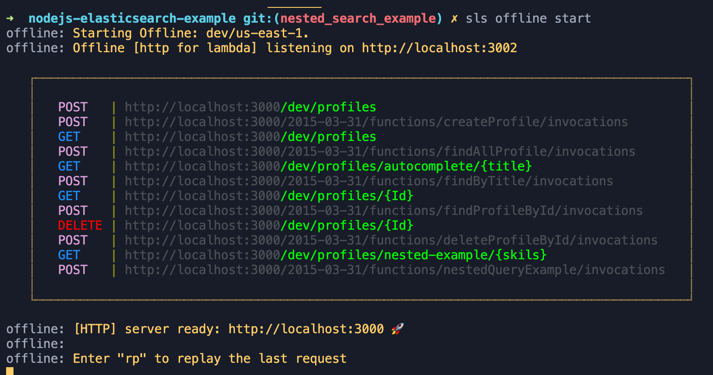

## A practical example for NodeJs, Elasticsearch, Serverless Framework for AWS Lambda

### The use case is such that we are creating a LinkedIn Profile, bellow are the operations that can be done with this profiles

- create a profile
- update a profile
- delete a profile
- find a profile by id
- find all profiles (response with top 5 result)
- autocomplete feature for title field 
- search profile by matching skils (e.g  get all profiles that match "Elasticsearch")
- search for profile by licesnce and certifications certifications (e.g find all profiles that match aws certified solutions architect)

### The design diagram

## Getting started

### Make sure you have *node* and *npm* installed. 

 Then you will need to install the following things to get this project up and running

    git clone https://github.com/spati-java/nodejs-elasticsearch-example.git 

    cd nodejs-elasticsearch-example

    npm install -g serverless

    npm install serverless-offline --save-dev

### Before  you start the app, from the project folder type *sls offline* 
 You  should see the the *offline* on the console.

### Now on the console from the project folder 

        sls offline start

### If everything goes well you will see something like this in your console screen

