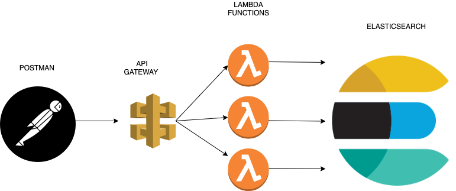
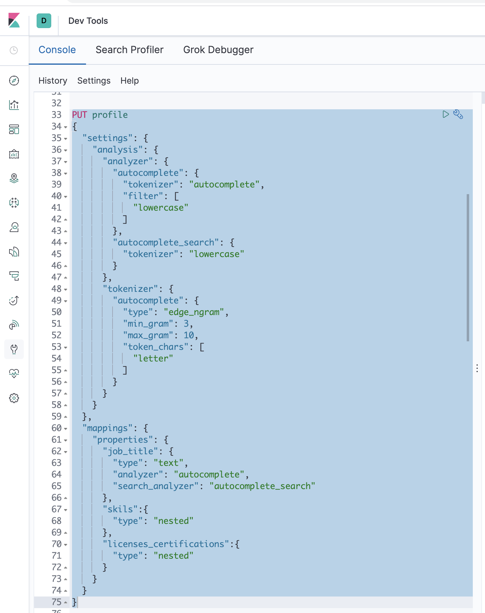
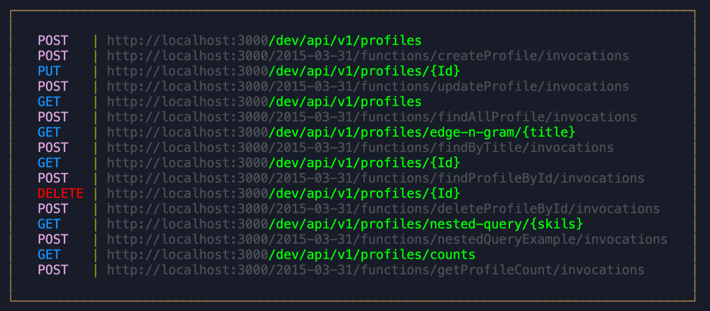

## A practical example for NodeJs, Elasticsearch, Serverless Framework for AWS Lambda

### Use Case Description
 *Like Linked-In profile , we create a back-end system which can do the following*

- create a profile
- update a profile
- delete a profile
- find a profile by id
- find all profiles (response with top 5 result)
- autocomplete feature for title field (in other other word type ahead feature, as you keep typing data on a search field, data should be auto matically populated)
- search profile by matching skils (e.g  get all profiles that match "Elasticsearch")
- search for profile by licesnce and certifications certifications (e.g find all profiles that match aws certified solutions architect)

### The design diagram

## Getting started

### Set up elasticsearch

      docker pull docker.elastic.co/elasticsearch/elasticsearch:7.6.2

      docker run -p 9200:9200 -p 9300:9300 -e "discovery.type=single-node" docker.elastic.co/elasticsearch/elasticsearch:7.6.2
      

### Set up kibana 

     docker pull docker.elastic.co/kibana/kibana:7.6.2

     docker run --link YOUR_ELASTICSEARCH_CONTAINER_NAME_OR_ID:elasticsearch -p 5601:5601 {docker-repo}:{version}   

#### create the index using mapping_settings.json file : should looks like this

### Set up Serverless framework
 
##### Make sure you have *node* and *npm* installed. 

##### Then you will need to install the following things to get this project up and running
    
      git clone https://github.com/spati-java/nodejs-elasticsearch-example.git 

      cd nodejs-elasticsearch-example
      
      npm install -g serverless

      npm install serverless-offline --save-dev

### Before  you start the app, from the project folder type *sls offline* 
 You  should see the the *offline* on the console.

### Now on the console from the project folder 

        sls offline start

If everything goes well you will see something like this in your console screen

### Now you can use some rest client like postman to test all of the endpoints

## HAPPY LEARNING!! 
